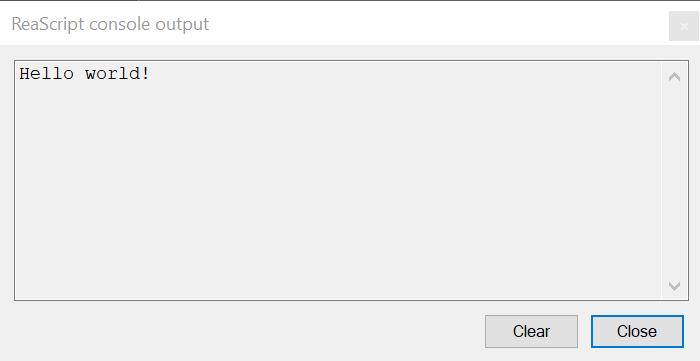
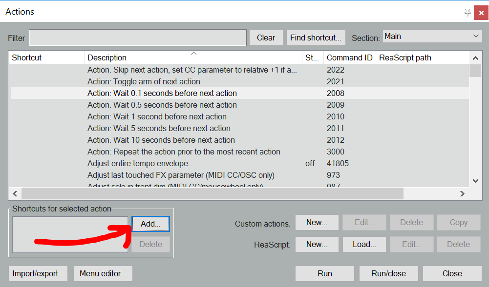

How to create and run scripts in REAPER: a *Hello world* example
================================================================

In this super simple tutorial, you'll learn the basic setup you'll need every time you'll use reapy.

Creating a script
*****************

A script is a file with the ``.py`` extension that contains Python code and can be stored anywhere on the computer. Choose a directory where you will store the scripts of this tutorial. We'll assume it is called ``ROOT_DIRECTORY``. Inside it, create a file called ``hello_world.py``. Congrats, you've built your first script! It does nothing, but does it well. Let's make it useful now.

Find yourself a nice code editor (plenty of great free editors are available out there) and open ``ROOT_DIRECTORY/hello_world.py`` with it. Type in the following:

.. code:: py

    import reapy
    reapy.print('Hello world!')

and you're done! Each of the line above does a pretty simple thing:

1. The first one *imports* ``reapy``. It makes it available for use in your script by connecting it to REAPER.
2. The second one asks reapy to *print* a message to the REAPER console. You may be familiar with Python ``print()`` function that outputs strings to the standard terminal - :func:`reapy.print` does exactly the same with the REAPER console instead of the terminal.

Running a script from terminal
******************************

Open REAPER and a terminal. In the latter, go to your working directory:

.. code:: bash

    cd path/to/ROOT_DIRECTORY

and then run:

.. code:: bash

    python hello_world.py

.. note::

    If you've read the detailed installation instructions, you already know that you have to replace ``python`` by ``py`` on Windows.

The following window will show up in REAPER:

You've just controlled REAPER with Python for the first time!

Running a script from REAPER
****************************

For most scripts, your ultimate purpose will be to automate something you do too often in REAPER. Thus, you'd probably rather trigger it from a REAPER toolbar or a keyboard shortcut than run ``cd path/to/ROOT_DIRECTORY`` and ``python script.py`` every time.

Adding a script to *Actions* list
.................................

If you've sticked to REAPER basic functionality so far, you probably haven't met its *Actions* list. Open the *Actions* menu and click *Show action list...* or simply hit the ``?`` key to open it: it contains all the elementary commands that REAPER can run.

This list can be extended with your own scripts (called *ReaScripts* in REAPER). Click *Add...* next to *ReaScript* in the bottom right corner and navigate to ``ROOT_DIRECTORY/hello_world.py``.

.. warning::

    By default, REAPER filters for ``.lua`` files when selecting a new ReaScript. Be sure to filter for Python (``.py``) files instead.

    .. image:: ../_static/tutos/basics/filter_for_python_files.png
        :alt: Filter for Python files
        :width: 400px
        :align: center

Your script is now available in the *Actions* list as *Script: hello_world.py*.

Triggering scripts with keyboard shortcuts
..........................................

All actions can be assigned to a keyboard shortcut by clicking the *Add...* button in the bottom-left corner:

Use this to trigger your script with the shortcut of your choice. Looking good, right?

Triggering scripts with toolbar buttons
.......................................

Actions can also be added to toolbars as buttons. Right-click an empty space in a toolbar and go to *Customize toolbar...*. In the bottom-left corner, you can *Add...* any action to the toolbar. Clicking *Icon...* allows to customize the associated icon. *Save* the toolbar, and you'll have a brand new button to throw a *Hello world!* whenever you need it!

.. raw:: html

    
